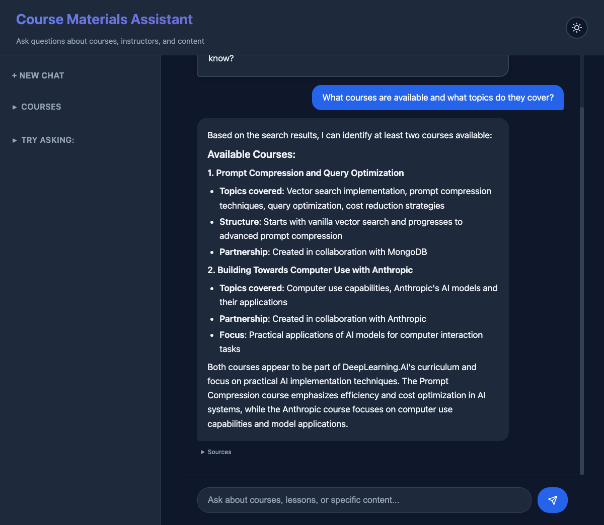

# Intelligent Course Materials RAG System

An advanced **Retrieval-Augmented Generation (RAG)** system that provides intelligent, context-aware responses to course-related queries through semantic search and AI-powered analysis.



## Project Overview

This full-stack web application demonstrates modern AI engineering practices by combining **semantic search**, **vector databases**, and **large language models** to create an intelligent educational assistant. The system intelligently decides when to search through course materials versus answering from the AI's general knowledge base.

### Key Technical Features

- **🔍 Smart Query Processing**: Tool-based architecture where Claude autonomously decides when to search course content vs. direct response
- **🧠 Advanced RAG Implementation**: Semantic search using sentence transformers with ChromaDB vector database
- **⚡ Real-time AI Integration**: Anthropic Claude API with sophisticated tool execution capabilities
- **📚 Document Intelligence**: Automated parsing and chunking of course materials with metadata extraction
- **💬 Session Management**: Persistent conversation history with context continuity
- **🎨 Modern Web Interface**: Responsive chat interface with markdown rendering and collapsible source display

### Technical Stack

- **Backend**: FastAPI with Python 3.13, UV package manager
- **AI/ML**: Anthropic Claude Sonnet 4, Sentence Transformers (all-MiniLM-L6-v2)
- **Vector Database**: ChromaDB for semantic search and embeddings storage
- **Frontend**: Vanilla HTML5/CSS3/JavaScript with real-time chat interface
- **Architecture**: Tool-based RAG with intelligent query routing and session persistence

### System Architecture

The application uses a sophisticated **tool-calling approach** where:

1. **Query Analysis**: Claude analyzes user queries and decides whether to search or respond directly
2. **Semantic Search**: If needed, performs vector similarity search in ChromaDB with course filtering
3. **Content Synthesis**: Combines search results with AI knowledge for comprehensive responses
4. **Session Management**: Maintains conversation context across interactions

This approach reduces unnecessary vector operations while providing more natural conversational flow compared to traditional RAG systems that always retrieve.


## Prerequisites

- **Python**: 3.13 or higher
- **Package Manager**: [uv](https://docs.astral.sh/uv/) (modern Python package manager)
- **API Access**: Anthropic API key ([Get yours here](https://console.anthropic.com/))
- **Platform**: Cross-platform (Linux, macOS, Windows)
  - **Windows users**: Use Git Bash - [Download Git for Windows](https://git-scm.com/downloads/win)

## Installation & Setup

### 1. Install UV Package Manager
```bash
curl -LsSf https://astral.sh/uv/install.sh | sh
```

### 2. Clone and Install Dependencies
```bash
git clone <repository-url>
cd claudecode_ragchatbot
uv sync
```

### 3. Configure Environment
Create a `.env` file in the root directory:
```bash
ANTHROPIC_API_KEY=your_anthropic_api_key_here
```

## Running the Application

### Quick Start (Recommended)
```bash
chmod +x run.sh
./run.sh
```

### Manual Start
```bash
cd backend
uv run uvicorn app:app --reload --port 8000
```

### Access Points
- **📱 Web Interface**: http://localhost:8000
- **📚 API Documentation**: http://localhost:8000/docs
- **🔧 Interactive API**: http://localhost:8000/redoc

The application will automatically:
- Load course materials from the `courses/` directory
- Initialize the vector database with embeddings
- Start the web server with hot reload enabled

