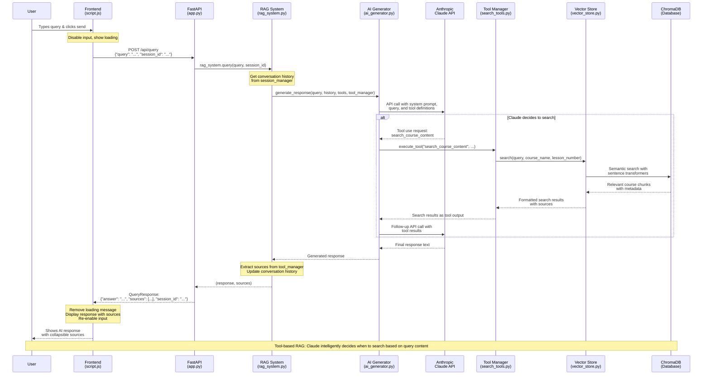

# RAG System Query Flow Diagram

## Key Components

### Frontend (script.js)
- **Input Handling**: Captures user input and manages UI state
- **API Communication**: Sends POST requests to `/api/query`
- **Response Display**: Renders markdown responses with sources

### Backend API (app.py)
- **Request Validation**: Uses Pydantic models for type safety
- **Session Management**: Creates/maintains conversation sessions
- **RAG Orchestration**: Delegates to RAG system for processing

### RAG System (rag_system.py)
- **Central Coordinator**: Manages all system components
- **History Management**: Maintains conversation context
- **Tool Integration**: Provides search capabilities to AI

### AI Generator (ai_generator.py)
- **Claude Integration**: Handles Anthropic API communication
- **Tool Execution**: Processes function calls from Claude
- **Response Synthesis**: Combines search results into coherent answers

### Search Tools (search_tools.py)
- **Smart Search**: Semantic search with course/lesson filtering
- **Source Tracking**: Maintains references for UI display
- **Result Formatting**: Structures search output for Claude

### Vector Store (vector_store.py)
- **Semantic Search**: ChromaDB with sentence transformers
- **Content Storage**: Course chunks with rich metadata
- **Flexible Queries**: Supports filtering by course and lesson

## Query Types

1. **General Knowledge**: Claude answers directly without searching
2. **Course-Specific**: Claude searches first, then synthesizes response
3. **Contextual**: Uses conversation history for better understanding

The system uses **intelligent tool selection** where Claude autonomously decides when to search based on the query content, making it more efficient than traditional always-retrieve RAG systems.